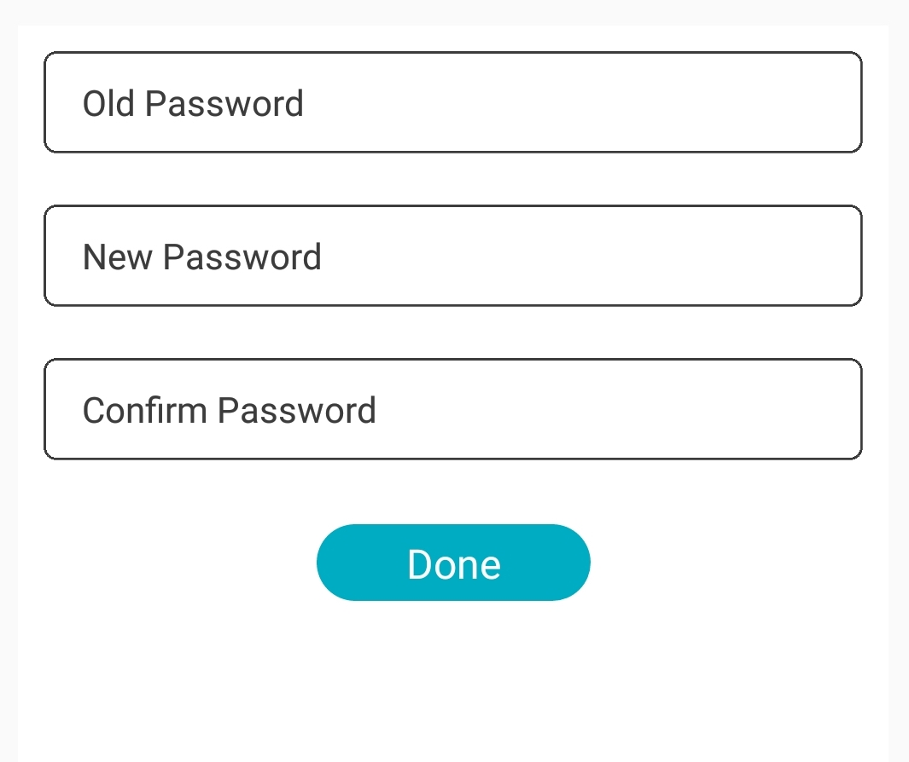

<h1>Introduction</h1>
INTUZ presents a very handy React Native component which allows you to have a ready-made control for change password inside your next mobile app projects. Try it your self by following below integration, Enjoy!

<br>
<h1>Features</h1>

- Cutomizable your text
 

<br>


**<h1>Getting Started</h1>**

> Import ChangePasswordController in your .js file

```
import ChangePasswordController from './app/component/ChangePasswordController'   
```

> Render your ChangePasswordController

```
<ChangePasswordController 
	backgroundColor='white' 
	submitText='Save' 
	placeHolderCurrentPassword='Old Password'
	placeHolderNewPassword='New Password' 
	placeHolderConfirmPassword='Confirm Password' />

```
<br>
<h1>Properties</h1>

| Available properties | Type | Default Value | Required | Description |
|--------------------------|------------------------|-------------------------------|----------|-------------------------------------------------------------------------------------------------------------------------------------------------------------------------|
| backgroundColor | String | white | No | Background color for change password view |
| submitText | String  | Save | No | Text for Submit button |
| placeHolderCurrentPassword | String | Current Password | No | Placeholder text for current password |
| placeHolderNewPassword | String | New Password | No | Placeholder text for new password |
| placeHolderConfirmPassword | String | Confirm Password | No | Placeholder text for confirm password |

<br>
<h1>Bugs and Feedback</h1>

For bugs, questions and discussions please use the Github Issues.

<br>
<h1>License</h1>

Copyright (c) 2018 Intuz.
<br><br>
Permission is hereby granted, free of charge, to any person obtaining a copy of this software and associated documentation files (the "Software"), to deal in the Software without restriction, including without limitation the rights to use, copy, modify, merge, publish, distribute, sublicense, and/or sell copies of the Software, and to permit persons to whom the Software is furnished to do so, subject to the following conditions:
<br><br>
THE SOFTWARE IS PROVIDED "AS IS", WITHOUT WARRANTY OF ANY KIND, EXPRESS OR IMPLIED, INCLUDING BUT NOT LIMITED TO THE WARRANTIES OF MERCHANTABILITY, FITNESS FOR A PARTICULAR PURPOSE AND NONINFRINGEMENT. IN NO EVENT SHALL THE AUTHORS OR COPYRIGHT HOLDERS BE LIABLE FOR ANY CLAIM, DAMAGES OR OTHER LIABILITY, WHETHER IN AN ACTION OF CONTRACT, TORT OR OTHERWISE, ARISING FROM, OUT OF OR IN CONNECTION WITH THE SOFTWARE OR THE USE OR OTHER DEALINGS IN THE SOFTWARE.

<h1></h1>
<a href="http://www.intuz.com">

</a>
